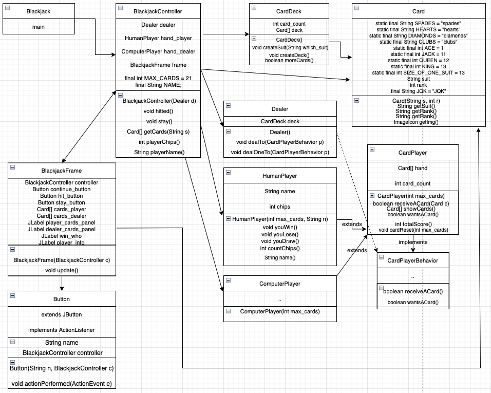
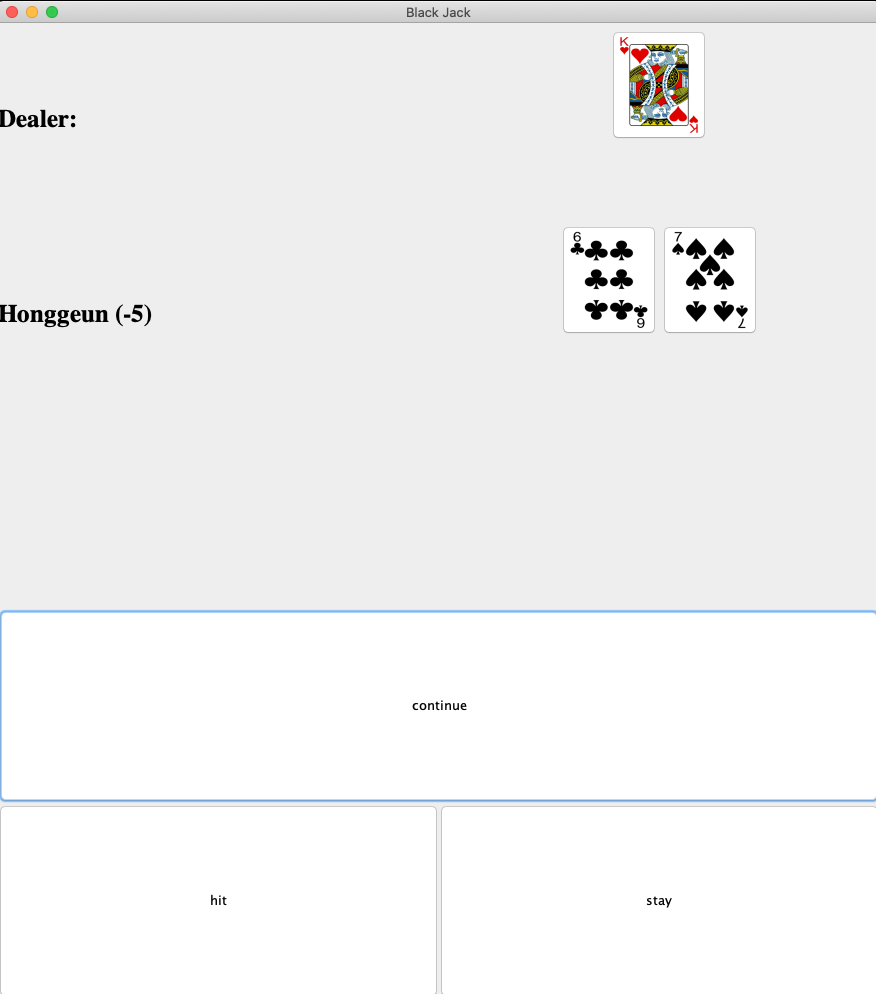
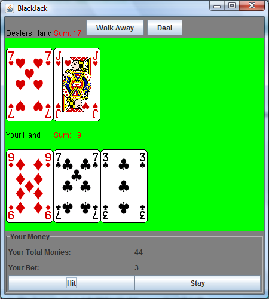

```
HONGGEUN JI version 0.1 (2021/12/05)
```

## Blackjack with GUI
Command Line 방식의 블랙잭 게임을 GUI와 Event를 이용하여 게임을 진행하도록 한다. Controller와 다른 모델들은 기존에 Command Line에서 동작하던 소스코드들을 사용하되, 플레이어와 상호작용하는 방식은 GUI와 Event를 이용한다.

## 요구사항
1. 손님의 이름을 입력 받는다.
2. 카드는 1벌을 사용하도록 한다. 게임은 무조건 21점 내외로 끝나므로 1벌이면 충분하다.
3. 카드는 처음 2장씩 나누어준다. 순서는 손님, 딜러, 손님, 딜러 순으로 나누어준다.
4. 초기에 딜러의 첫 카드를 제외하고 두 번째 카드를 보여준다.
5. 손님은 점수가 21점 미만인 경우 카드를 추가 요청할 수 있다.
6. 손님이 Hit 버튼을 누를 경우 카드를 추가로 제공하고, Stay 버튼을 누를 경우 제공하지 않는다.
7. 딜러의 경우, 총합이 17점 이상일때까지 카드를 추가한다.
8. A(에이스)는 1점 혹은 11점 중 유리한 쪽으로 선택할 수 있다.
9. 손님은 이길 때마다 칩을 하나씩 얻는다. 운이 좋게도 손님의 첫 두장의 합이 21이라면 딜러의 카드는 볼 필요 없이 손님이 이기는데, 이 경우 칩을 두개 획득한다.
10. 손님이 졌다면 칩을 하나 잃는다. 칩은 매 라운드가 진행하면서 항상 보여져야 한다.
11. 손님이 게임을 정말 못한다면 칩의 갯수는 음수가 될 수도 있다.
12. 게임을 진행하면서 받은 딜러와 손님의 카드는 모두 프레임에 보여져야 하며, 카드의 값(숫자 혹은 문자)과 모양 형태로 보여져야 한다.
</br>
</br>

## 클래스 다이어그램


</br>
</br>

## 작성 중인 프로그램 (완성)


</br>
</br>

## 이상적인 프로그램


</br>
</br>

## 클래스별 설명
1. Blackjack - 스타터 클래스
2. BlackjackController - 컨트롤러 클래스, 뷰와 모델 부분의 통제를 담당하고 게임 진행을 도와준다.
3. BlackjackFrame - 뷰 클래스, 버튼의 액션과 상호작용한다.
4. Button - 버튼 클래스, 버튼은 3가지 종류가 있다. (hit, stay, continue) 각각 역할에 따라 액션이 다르다.
5. Card - 카드 모델 클래스, 플레이어와 딜러가 사용할 카드 클래스이다. CardDeck으로부터 랜덤의 카드 정보를 지닌 카드 클래스가 생성된다. 생성된 이후에는 get메소드만 제공한다.
6. CardDeck - 카드덱 모델 클래스, 카드덱은 Dealer 클래스로부터 생성되고 Card 클래스와 마찬가지로 생성자 이외의 set 메소드는 없다.
7. CardPlayer - 플레이어 추상 모델 클래스, HumanPlayer와 ComputerPlayer가 본 클래스를 상속받아 사용한다. 카드를 받거나 현재 가진 카드 정보를 보여주는 역할을 한다.
8. CardPlayerBehavior - 플레이어 행동 인터페이스, CardPlayer 클래스에 의해 구현된다.
9. ComputerPlayer - 컴퓨터 플레이어 모델 클래스, CardPlayer를 상속받고 컴퓨터 플레이어를 위한 메소드를 지닌다.
10. Dealer - 딜러 모델 클래스, 딜러처럼 카드를 플레이어 혹은 컴퓨터 플레이어에게 나누어 준다.
11. HumanPlayer - 인간 플레이어 모델 클래스, 컴퓨터 플레이어와는 달리 hit 혹은 stay에 대한 선택을 할 수 있도록 하고 보유하고 있는 칩에 대한 정보도 나타내준다.
